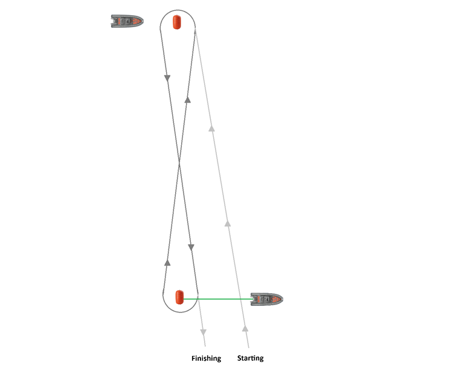
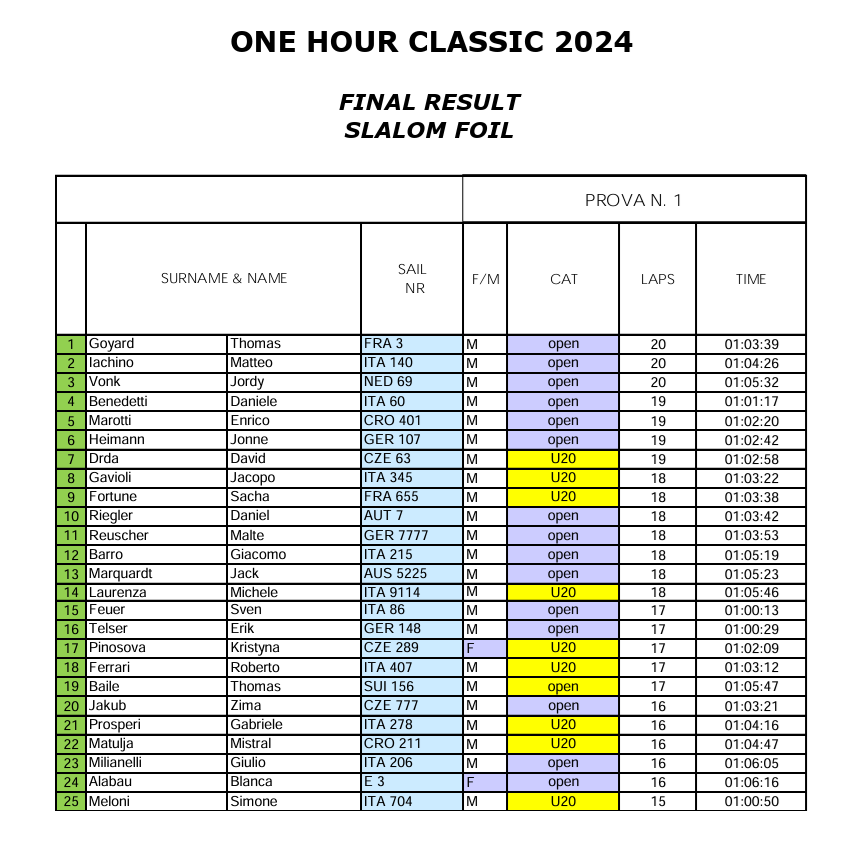
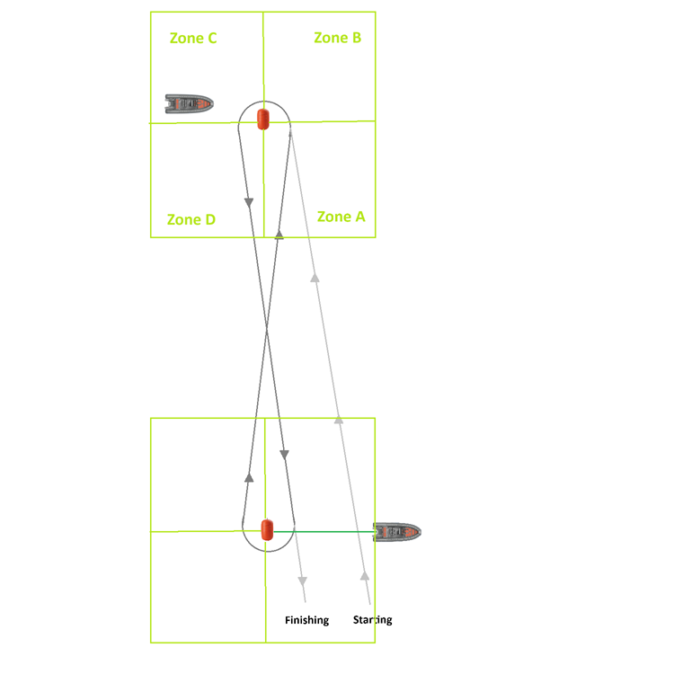
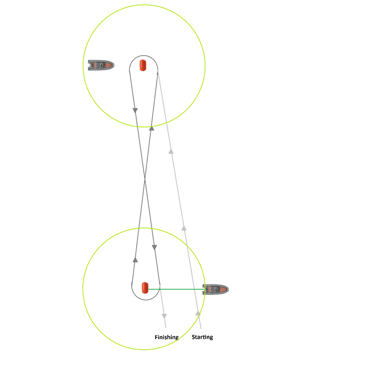
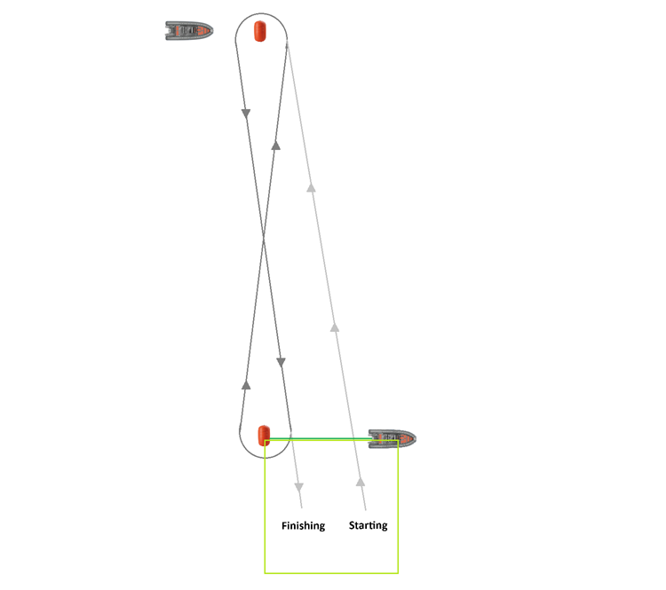
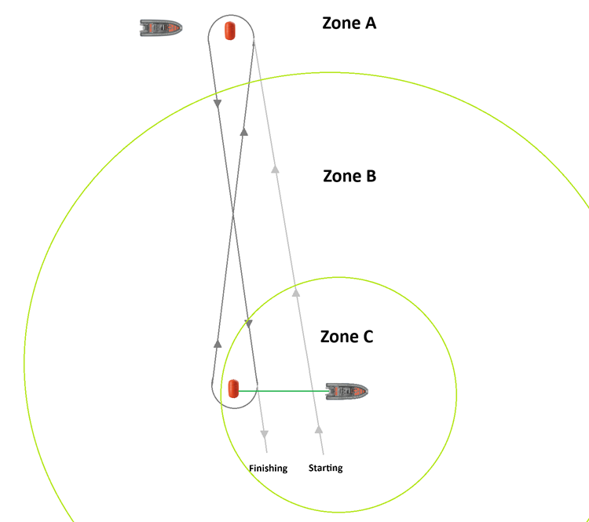

## UKWA Hour Classic

### Overview

- The race uses a "figure of eight" course, with two buoys approximately 1 km apart.
- The race starts with a rabbit start, where a gate opens between the buoy and the boat.
- The race finishes after an hour, but competitors get to compete their current lap.
- The riders should aim to complete as many laps as possible!

Results are based on the total number of completed laps and the time taken. This example is from the hour classic at Torbole in 2024.

### GPS Assistance

In principle the UKWA event could be run using the Motion GPS devices that belong to Weymouth Speed Week. Extracting data from these devices is straightforward, but some bespoke software would be required to process the results.

It should be assumed that the buoys will drift over time, and that the distance between them may change. The following sections describe a number of different approaches / algorithms that have been considered as possibilities, varying in complexity.

The most comprehensive (but complex) approach was conceived of first. The subsequent approaches were subsequent ideas that are far less onerous in terms of complexity, and development / testing.

#### Approach 1

The first possible approach requires a Motion GPS on each of the buoys, recording their position during every second of the race. The general idea is that gybes can be accurately detected for a rider passing though zones A, B, C, D. Individual finish times can also be established as the rider enters the appropriate zone(s) in the vicinity of the finish line.

This is the most complex approach that one might choose to implement, but most comprehensive. The ever changing orientation of the course, and application of adaptive geofencing would work really well, but requires a significant amount development + testing.

Additionally, there is also the requirement for Motion GPS devices to be mounted on top of both buoys, pointing upwards for a clear sky view. If either Motion GPS were to malfunction (e.g. not record any data) then it would be impossible to generate any results.

#### Approach 2

The second approach also requires a Motion GPS on both buoys, recording their position during every second of the race. Unlike the first approach, this one simply uses proximity checks to determine when the rider is in the proximity of each buoy, not comprehensive gybe detection. The boat crews would therefore need to keep an eye out for any cheating, and make a note of the final finishing positions.

This approach is a lot simpler than the first one, but also has the requirement for a Motion GPS on top of both buoys, pointing upwards for a clear sky view. If either device were to malfunction (e.g. not record any data) then it would be impossible to generate any results. It will also be reliant on the boat crews keeping an eye out for cheating at the gybe marks.

#### Approach 3

The third approach dispenses with the idea of a Motion GPS on the far buoy. It relies upon one Motion GPS on the boat, and another on the start / finish buoy. The general idea is to detect completed laps as people enter the green box through the use of adaptive geofencing. In simple terms, automatically adjusting the green box according to the location of the boat and the buoy. This is not nearly so complex as the first approach with comprehensive gybe detection, but still a lot more complex that the simple proximity tests of the second approach.

Approach 3 would provide accurate finishing times and somewhat simpler to develop + test than the approach 1, but still rather more complex than approach 2. It also requires a Motion GPS to be mounted on top of the first buoy, which may not be straightforward. It will still be reliant on the boat crews keeping an eye out for cheating at the gybe marks.

#### Approach 4

The final approach attempts to address some of the risks and complexities of the first three ideas. The start / finish boat can have a Motion GPS mounted so the device is secure, and has a clear sky view. A second Motion GPS can serve as backup, mitigating the risk(s) of data loss. It is very unlikely there would be any issue capturing the location of the start / finish boat.

The boat at the farthest buoy would need to keep an eye out for any cheating, but beyond a certain distance from the start / finish boat would be regarded as Zone A. It is when the rider re-enters zone C that they are deemed to have completed a lap, and it will be up to the boat crew to record the final order of finishers.

The radius of Zone C should be slightly larger than the distance between the start / finish boat and the buoy. Provisional results can be produced based on the times that riders enter Zone C on their final lap and where necessary, manually adjusted to match the order recorded by the crew. The start / finish boat should be relatively close to the buoy, so that Zone C can have a radius of around 100 meters.

There are two big advantages to this particular approach. It is far more practical because the buoys do not need a Motion GPS attached and facing upwards. Recording the position of the start / finish boat is far more practical and the risks of technical issues are far lower. Additionally the development + testing effort is significantly lower than the other ideas.

In essence, throughout the race each rider need only have the distance between their current location and the start / finish boat calculated. Determination of their lap times is based on entering Zone C, and they have to enter Zone A before another lap can be counted. It's a really simple algorithm to implement and does not require nearly so much development + testing effort.

### Summary

If the Motion GPS devices from Weymouth Speed Week were to be used for a UKWA hour classic, then the most practical solution would be as follows:

1. Attach two Motion GPS devices to the start / finish boat.
2. Use existing software to download data from the Motion GPS devices worn by riders.
3. Implement approach 4 to rank riders based on the number of laps and their approximate finish time.
4. Manually adjust the rankings where necessary, based on the finishing positions recorded by the boat crew.
5. Rankings should include the total distance for each rider, serving as a sanity check of the finishing positions.

It's still not an insignificant task to developer + test this system, but it is perhaps the most pragmatic approach!
